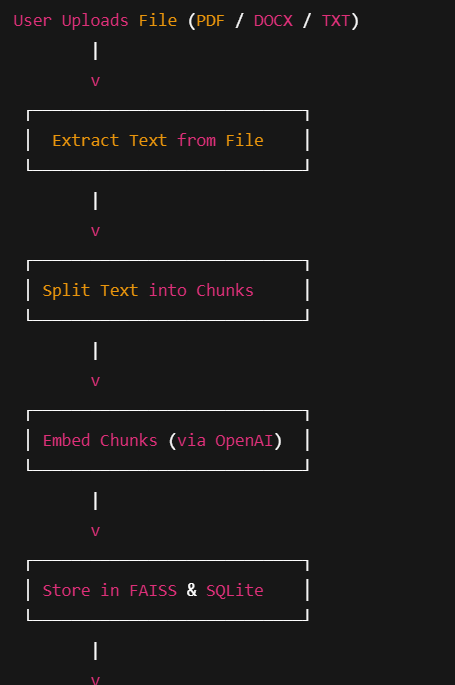

# chat-assistant

## 1️⃣ Document Search Workflow

## 2️⃣ Document Processing Workflow (Prepare for Chatbot)

## Detailed Description of Core Components

**Document Extraction (file_extraction.py) :**
This module handles the extraction of text from various document formats (e.g., PDF, DOCX). It ensures the content is extracted in a readable format for further processing.

**Text Preprocessing (preprocess.py) :**
Text extracted from documents often contains unwanted characters, noise, and formatting issues. This module cleans the text and prepares it for chunking and embedding.

**Chunking (chunks.py) :**
After preprocessing, the text is divided into smaller segments (chunks). This is essential for embedding and storing in a FAISS index.

**Embedding (embedding.py) :**
This module converts text chunks into embeddings (vector representations) using OpenAI’s embedding API. These embeddings are stored in a FAISS index for fast retrieval during semantic searches.

**Storage (storhouse.py) :**
Handles the storage of documents, metadata, embeddings, and chunked text in the SQLite database and FAISS index. It ensures that the document metadata, text, and embeddings are correctly stored and easily accessible.

**Pipeline (pipeline.py) :**
This is the orchestrator, managing the entire flow of the application from document extraction to embedding and storage. It ensures that the process is executed in a streamlined manner.

**Search (search.py) :**
Allows users to search for documents based on a text query. It supports both text-based (SQL) search and embedding-based (FAISS) search to provide comprehensive search results.
